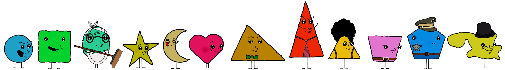
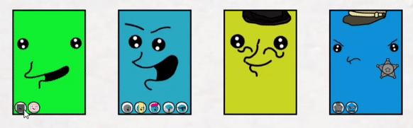
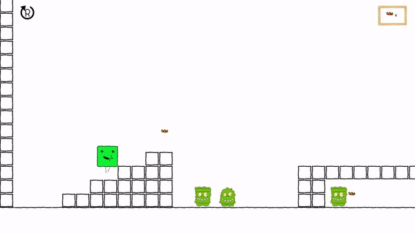
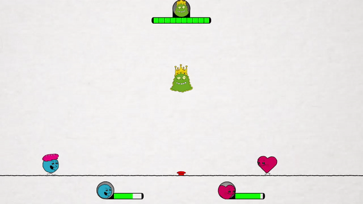

<h1 align="center"> Cuadradito y Circulito </h1>

  

***

<h2 align="center"> ¿De qué consta este repositorio?</h2>

Es un juego desarrollado en la plataforma Game Maker Studio 2 y codificado con en lenguaje propio del mismo (GML). Creado a partir de la serie de <a href="https://www.youtube.com/channel/UCqZz5zL_SIGzH0tV-OMdqhg" target="_blank">Cuadradito y Circulito</a> sin ningún tipo de fin de lucro.

***

<h2 align="center"> Personajes jugables </h2>
  

 

 

 Además, algunos de estos personajes poseen diferentes apariencias dentro del juego: 

 

 

 ***

<h2 align="center"> Un jugador </h2>

El modo para un solo jugador tiene como objetivo recolectar un total de 10 mariposas para desbloquear la puerta y poder pasar al siguiente nivel.
Para esto el jugador debe administrar bien sus saltos, ya que el personaje tiene solo doble salto y hay bloques que requieren un poco mas de dos saltos (para poder pasar sobre ellos se debe usar la mecánica de rebotar sobre un enemigo). Si uno de estos dos saltos se utiliza de forma no eficiente puede derivar al reinicio de nivel.
  

*** 
  
<h2 align="center"> Multijugador </h2>

Existen dos tipos de modo de juego en multijugador, estos son supervivencia y cooperativo. Para jugar este modo, tanto el jugador uno como el jugador dos, pueden elegir entre los diferentes personajes que aparecen en la serie animada.

<h3 align="center"> Supervivencia: </h3>
En supervivencia, los jugadores deberán mantenerse el mayor tiempo en pie posible. El juego termina, y el ganador se consgara, si el alien golpea a uno de estos o si la vida de alguno llega a cero. La vida se reduce al quedarse en la misma posición sin moverse. 

<h3 align="center"> Cooperativo: </h3>
En cooperativo, los jugadores deberán unir fuerzas para derrotar el alien. Para hacer esto, deberán mantenerse con vida y presionar el botón rojo que se encuentra en el centro de la pantalla. Esto provocará que una piedra lunar sea lanzada por la pantalla, si ésta golpea al alien, perderá una vida. Pero si el alien golpea a uno de los jugadores acabará con su vida. El juego termina cuando el alien quede sin vida o ambos jugadores mueran. Al igual que en el modo Suoervivencia, la vida se reduce al quedarse en la misma posición sin moverse. 

***

<h2 align="center"> Mis Redes </h2>

  

